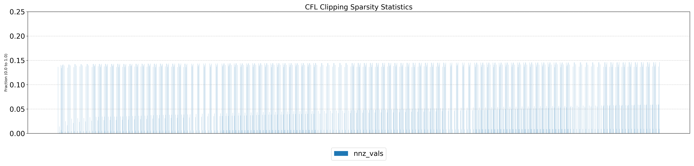
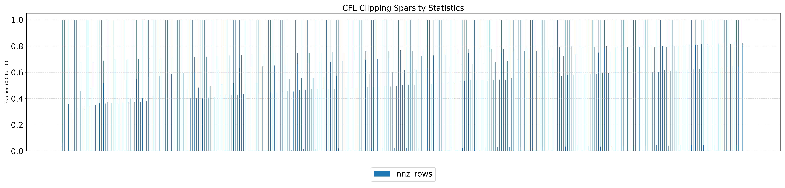
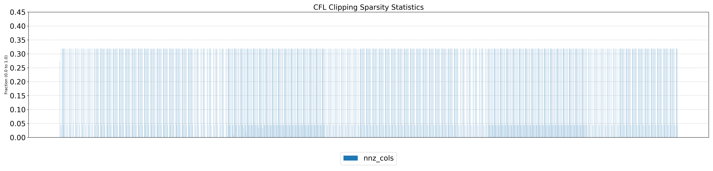

# Optimization-Relevant Flags
## ICON
```bash
# Ask Ben why -g and not -lineinfo?
export CUDA_FLAGS="-g -O3 -arch=sm_90 -ccbin=nvc++"
# ICON has issues with -O3 if I remember correctly
export FCFLAGS="-g -O2 -Mrecursive -Mallocatable=03 -Mstack_arrays -acc=gpu -gpu=cc90"
```

## Standalone Pipeline
```bash
# BIN_FLAGS when build a binary for the standalone verificaiton pipeline
export BIN_FLAGS="-Xcompiler=-O3 --expt-relaxed-constexpr -arch=native --use_fast_math -O3 -lineinfo --ftz=true --prec-div=false
--prec-sqrt=false --fmad=true -Xptxas=-O3 -Xptxas=-v -Xcompiler=-march=native -Xcompiler=-mtune=native --restrict -Xcompiler=-fopenmp -std=c++20"

# LIB_FLAGS when building the library
export LIB_FLAGS="--expt-relaxed-constexpr -arch=native -O3 -Xcompiler=-O3 -lineinfo --fmad=true --prec-div=false --prec-sqrt=false
--ftz=false -DNO_SERDE -std=c++17 -rdc=true -Xcompiler=-fPIC --compiler-options '-fPIC' --shared "
```

# OpenACC + ICON
## Outline of Profiling ICON

```fortran
! Code-snippet for Fortran Velocity Tendencies Measurements
! In solve_nonhydro
!$ACC WAIT (added it manually)
CALL velocity_tendencies(...)

! In velocity_advection
print *, "Called istep=<ISTEP>, lvn_only=<LVN_ONLY>"
! Commented out
!IF (timers_level > 5) CALL timer_stop(timer_solve_nh_veltend)
CALL cpu_time(start_time)

!Velocity Tendencies Code

! Commented out
!IF (timers_level > 5) CALL timer_stop(timer_solve_nh_veltend)
!$ACC WAIT (Did not add this manually, their code has it)
CALL cpu_time(end_time)
elapsed_time = end_time - start_time
print *, 'Elapsed time (seconds): ', elapsed_time
```

## Relevant Configuration

The following parameters are set in `R02B9` which uses a grid from `R02B04` committed to the repi.
```bash
# Radiation Disabled
inwp_radiation=0

# Nproma set to be the same
nproma=20480
num_io_procs=0

# In the resulting .run file:
# For Radiation
nproma=20480
nproma_sub=48
nblocks_c=1
proc0_shift=0
```

In the configuration, different from `clariden_ben_dace_gpu.gh200.nvidia` configuration wrapper:
```bash
--disable-mpi
```

### A100

TODO

### GH200

Note: `istep=1, lvn_only=0` is called only once, and involves first-touch data allocation too.

```bash
Mean: 3869.1 µs, Median: 3869.1 µs, (istep: 1, lvn Only: 0)
Mean: 442.4 µs, Median: 442.5 µs, (istep: 1, lvn Only: 1)
Mean: 445.7 µs, Median: 442.5 µs, (istep: 2, lvn Only: 0)
```

## Inspection of Clip-Counts

Compile with:
```bash
export INSPECT_DEF=-D_INSPECT_CLIPPING
# Run configure as usual:
# ../../config
# Need to copy grids, something like this:
# cp -R ../../grids/ .
```

Looks like clipping array has very often has non-zero values. Some plots:

Number of Non-Zero Values in the Clipping Array:


Number of Non-Zero Rows in the Clipping Array:


Number of Non-Zero Columns in the Clipping Array:


# OpenACC + SDFG Integration (GB Submission)
### A100

TODO

### GH200

TODO

# Standalone Pipeline w. Host-side Timers
## No-Tiling w. Clipping
### A100

```bash
export _RELEASE=TRUE
export _USE_NVHPC=TRUE
export _USE_CUDA_EVENTS=FALSE
# Downloaded the file before measurement completed
python -m utils.stages.compile_gpu_stage7 1>run_a100_host_timer_jul_1.out 2>run_a100_host_timer_jul_1.err
# From file run_a100_host_timer_jul_1.err
Mean: 1006.15 µs, Median: 918.50 µs, (timestep: 1, istep: 1, lvn Only: 0)
Mean: 685.55 µs, Median: 649.00 µs, (timestep: 2, istep: 2, lvn Only: 0)
Mean: 694.95 µs, Median: 663.00 µs, (timestep: 7, istep: 1, lvn Only: 1)
Mean: 647.55 µs, Median: 647.00 µs, (timestep: 9, istep: 2, lvn Only: 0)
Mean: 664.00 µs, Median: 664.00 µs, (timestep: 43, istep: 1, lvn Only: 1)
Mean: 648.45 µs, Median: 649.00 µs, (timestep: 93, istep: 2, lvn Only: 0)
Average of medians: 654.40 µs (timestep 1 skipped)
```

### GH200
```bash
export _RELEASE=TRUE
export _USE_NVHPC=TRUE
export _USE_CUDA_EVENTS=FALSE
uenv start --view=default icon/25.2:v1@santis
# Example, output file name prob. should be when running another day
python -m utils.stages.compile_gpu_stage7 1>run_gh200_host_timer_jul_1.out 2>run_gh200_host_timer_jul_1.err
# From file run_gh200_host_timer_jul_1.err
Mean: 549.30 µs, Median: 469.50 µs, (timestep: 1, istep: 1, lvn Only: 0)
Mean: 385.75 µs, Median: 347.00 µs, (timestep: 2, istep: 2, lvn Only: 0)
Mean: 395.50 µs, Median: 359.00 µs, (timestep: 7, istep: 1, lvn Only: 1)
Mean: 348.30 µs, Median: 348.00 µs, (timestep: 9, istep: 2, lvn Only: 0)
Mean: 360.85 µs, Median: 360.50 µs, (timestep: 43, istep: 1, lvn Only: 1)
Mean: 352.10 µs, Median: 350.00 µs, (timestep: 93, istep: 2, lvn Only: 0)
Mean: 356.75 µs, Median: 355.50 µs, (timestep: 463, istep: 1, lvn Only: 1)
Mean: 353.30 µs, Median: 351.50 µs, (timestep: 519, istep: 2, lvn Only: 0)
Mean: 350.50 µs, Median: 349.00 µs, (timestep: 1140, istep: 2, lvn Only: 0)
Mean: 350.65 µs, Median: 349.50 µs, (timestep: 1814, istep: 2, lvn Only: 0)
Mean: 354.15 µs, Median: 353.00 µs, (timestep: 2593, istep: 1, lvn Only: 1)
Mean: 357.90 µs, Median: 356.50 µs, (timestep: 5701, istep: 1, lvn Only: 1)
Average of medians: 352.68 µs (timestep 1 skipped)
```

## No-Tiling w/o Clipping

Numerical verification analysis on the standalone pipeline indicadates that removing the clipping and clipping related kernels do not affect the runtime at all.

### A100

```bash
Mean: 899.95 µs, Median: 824.00 µs, (timestep: 1, istep: 1, lvn Only: 0)
Mean: 583.00 µs, Median: 554.00 µs, (timestep: 2, istep: 2, lvn Only: 0)
Mean: 606.45 µs, Median: 579.00 µs, (timestep: 7, istep: 1, lvn Only: 1)
Mean: 554.65 µs, Median: 554.50 µs, (timestep: 9, istep: 2, lvn Only: 0)
Mean: 579.00 µs, Median: 579.00 µs, (timestep: 43, istep: 1, lvn Only: 1)
Mean: 553.30 µs, Median: 553.00 µs, (timestep: 93, istep: 2, lvn Only: 0)
Mean: 579.45 µs, Median: 579.50 µs, (timestep: 463, istep: 1, lvn Only: 1)
Mean: 575.95 µs, Median: 556.00 µs, (timestep: 519, istep: 2, lvn Only: 0)
Mean: 553.85 µs, Median: 554.50 µs, (timestep: 1140, istep: 2, lvn Only: 0)
Mean: 554.85 µs, Median: 556.00 µs, (timestep: 1814, istep: 2, lvn Only: 0)
Mean: 597.10 µs, Median: 581.50 µs, (timestep: 2593, istep: 1, lvn Only: 1)
Mean: 597.15 µs, Median: 579.50 µs, (timestep: 5701, istep: 1, lvn Only: 1)
Average of medians: 566.05 µs (timestep 1 skipped)
```

### GH200

```bash
export _RELEASE=TRUE
export _USE_NVHPC=TRUE
export _USE_CUDA_EVENTS=TRUE
uenv start --view=default icon/25.2:v1@santis
Mean: 475.80 µs, Median: 409.00 µs, (timestep: 1, istep: 1, lvn Only: 0)
Mean: 326.85 µs, Median: 290.50 µs, (timestep: 2, istep: 2, lvn Only: 0)
Mean: 347.95 µs, Median: 313.50 µs, (timestep: 7, istep: 1, lvn Only: 1)
Mean: 296.80 µs, Median: 294.50 µs, (timestep: 9, istep: 2, lvn Only: 0)
Mean: 312.80 µs, Median: 313.50 µs, (timestep: 43, istep: 1, lvn Only: 1)
Mean: 296.15 µs, Median: 295.50 µs, (timestep: 93, istep: 2, lvn Only: 0)
Mean: 315.00 µs, Median: 313.00 µs, (timestep: 463, istep: 1, lvn Only: 1)
Mean: 296.95 µs, Median: 294.50 µs, (timestep: 519, istep: 2, lvn Only: 0)
Mean: 294.90 µs, Median: 294.00 µs, (timestep: 1140, istep: 2, lvn Only: 0)
Mean: 295.75 µs, Median: 294.50 µs, (timestep: 1814, istep: 2, lvn Only: 0)
Mean: 315.05 µs, Median: 314.50 µs, (timestep: 2593, istep: 1, lvn Only: 1)
Mean: 315.65 µs, Median: 315.00 µs, (timestep: 5701, istep: 1, lvn Only: 1)
Average of medians: 311.83 µs (timestep 1 skipped)
```

# Standlone Pipeline w. CUDA Event Timers
## No-Tiling w. Clipping

General observation: since we need to a synchronization on the threads for data to return to the CPU for the reduction, only using events do not perform better.
The measurements here are stale.

### A100
```bash
export _RELEASE=TRUE
export _USE_NVHPC=TRUE
export _USE_CUDA_EVENTS=TRUE
Mean: 993.33 µs, Median: 907.26 µs, (timestep: 1, istep: 1, lvn Only: 0)
Mean: 678.30 µs, Median: 643.07 µs, (timestep: 2, istep: 2, lvn Only: 0)
Mean: 691.66 µs, Median: 655.87 µs, (timestep: 7, istep: 1, lvn Only: 1)
Mean: 642.92 µs, Median: 643.07 µs, (timestep: 9, istep: 2, lvn Only: 0)
Mean: 656.54 µs, Median: 655.87 µs, (timestep: 43, istep: 1, lvn Only: 1)
Mean: 643.79 µs, Median: 642.05 µs, (timestep: 93, istep: 2, lvn Only: 0)
Mean: 655.72 µs, Median: 655.36 µs, (timestep: 463, istep: 1, lvn Only: 1)
Mean: 645.12 µs, Median: 644.10 µs, (timestep: 519, istep: 2, lvn Only: 0)
Mean: 643.02 µs, Median: 642.56 µs, (timestep: 1140, istep: 2, lvn Only: 0)
Mean: 644.15 µs, Median: 643.07 µs, (timestep: 1814, istep: 2, lvn Only: 0)
Average of medians: 647.22 µs (timestep 1 skipped)
```

## GH200
```bash
export _RELEASE=TRUE
export _USE_NVHPC=TRUE
export _USE_CUDA_EVENTS=TRUE
uenv start --view=default icon/25.2:v1@santis
Mean: 530.11 µs, Median: 450.94 µs, (timestep: 1, istep: 1, lvn Only: 0)
Mean: 347.07 µs, Median: 307.10 µs, (timestep: 2, istep: 2, lvn Only: 0)
Mean: 407.59 µs, Median: 364.80 µs, (timestep: 7, istep: 1, lvn Only: 1)
Mean: 354.89 µs, Median: 351.66 µs, (timestep: 9, istep: 2, lvn Only: 0)
Mean: 377.35 µs, Median: 370.32 µs, (timestep: 43, istep: 1, lvn Only: 1)
Mean: 359.06 µs, Median: 357.15 µs, (timestep: 93, istep: 2, lvn Only: 0)
Mean: 369.44 µs, Median: 368.14 µs, (timestep: 463, istep: 1, lvn Only: 1)
Mean: 354.23 µs, Median: 352.66 µs, (timestep: 519, istep: 2, lvn Only: 0)
Mean: 356.74 µs, Median: 355.31 µs, (timestep: 1140, istep: 2, lvn Only: 0)
Mean: 355.88 µs, Median: 354.34 µs, (timestep: 1814, istep: 2, lvn Only: 0)
Mean: 366.32 µs, Median: 365.52 µs, (timestep: 2593, istep: 1, lvn Only: 1)
Mean: 368.16 µs, Median: 366.77 µs, (timestep: 5701, istep: 1, lvn Only: 1)
Average of medians: 355.80 µs (timestep 1 skipped)
```